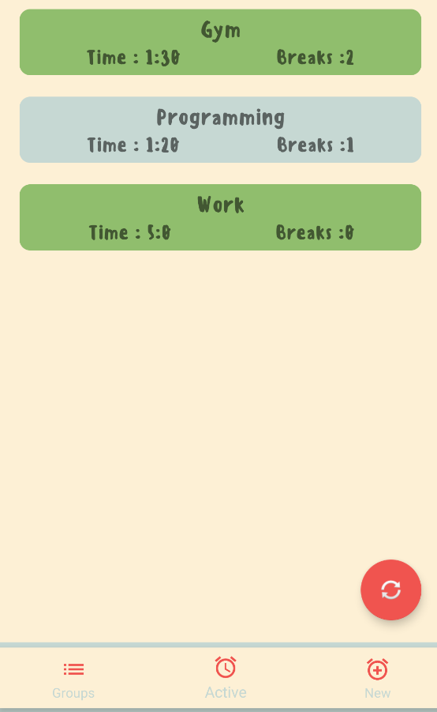
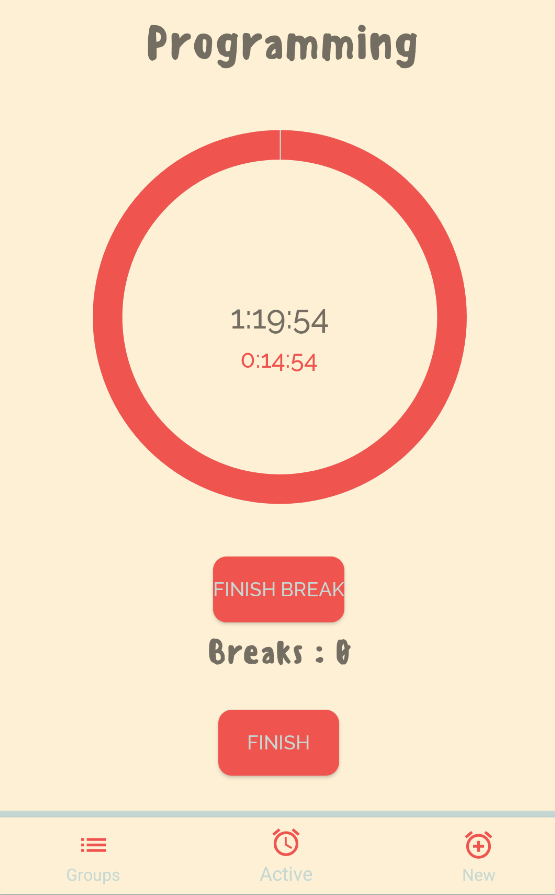
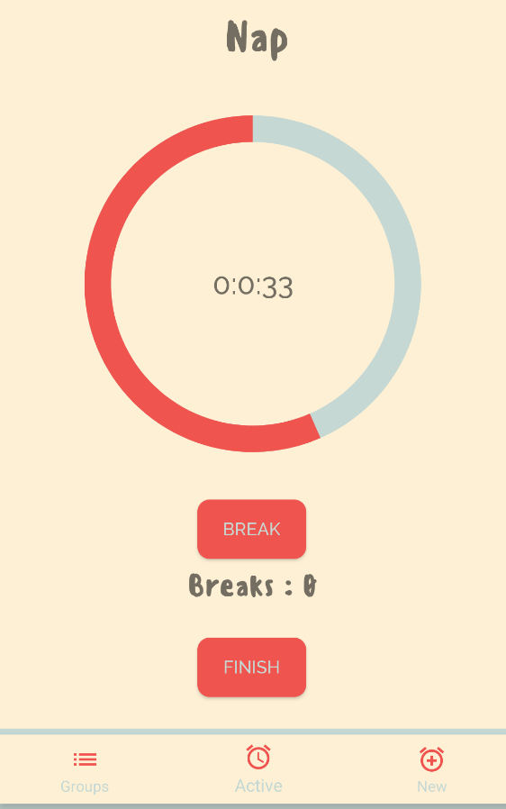
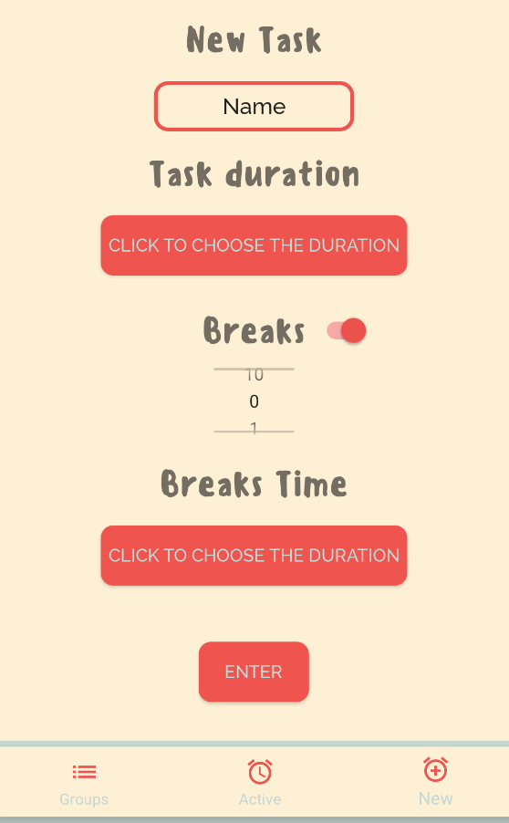
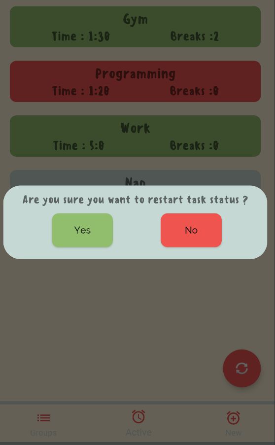

<h1 align="center">OptLearn</h1>

 

 

</h1>

## Project Overview 🎉
The app helps you manage your study or work time, while timers and a break system enable you to work more efficiently.
## Tech/framework used 🔧

| Tech                                                    | 
| ------------------------------------------------------- | 
| [Room](https://developer.android.com/training/data-storage/room)                           
| [MVVM](https://developer.android.com/topic/libraries/architecture/viewmodel)                       
| [Navigation](https://developer.android.com/guide/navigation)                         

## Screenshots 📺

    

    

    

    

## Features 🔍
✔️ Helps to organise tasks  
✔️ Break system  
✔️ Mark taks as succesful/failured  
✔️ Tasks/Breaks Timers  
